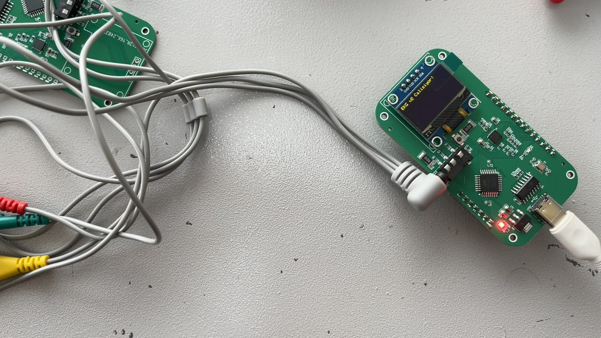

# Seismocardiography (SCG) Sensor Module

## Overview
This repository contains a low-cost, open-source embedded hardware design for **seismocardiography (SCG)** applications. The system captures micro-vibrations on the body surface caused by cardiac mechanical activity, using an accelerometer coupled with a microcontroller-based acquisition platform.

## Hardware Description
The module is built around an **ATmega328P** microcontroller and supports USB programming through a **CH340C** USB-to-serial converter.

- **Microcontroller:** ATmega328P  
- **USB Interface:** CH340C  
- **Power Input:** 5V  
- **Voltage Regulation:** AMS1117-3.3  
- **Available Interfaces:** GPIO, SPI, I²C  
- **Purpose:** Acquisition of SCG signals, optional synchronized ECG measurement  

All essential interfaces (GPIO, SPI, I²C) are exposed to allow integration of additional sensors or external modules.

## Application
This hardware platform enables the simultaneous acquisition of **SCG** and **ECG** signals. It can serve as a complementary measurement module for multimodal cardiac monitoring, research experiments, or wearable biomedical instrumentation.

## Features
- Low-cost, reproducible open hardware
- USB-programmable microcontroller
- Expandable sensor interface
- Suitable for cardiac signal research and prototyping

**Doğukan Sahil**  
Email: **dogukansahil@gmail.com**  
X: **https://x.com/dogukansahil**
